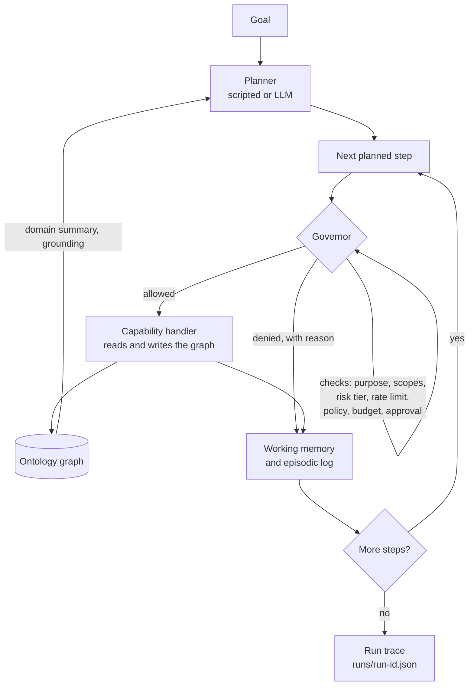

# Architecture

## The ontology comes first

Everything in this system stands on the domain graph. Before any agent plans anything, the business is modelled as typed entities (customers, sites, work orders, technicians, invoices) and typed relations (`belongs_to`, `raised_at`, `assigned_to`, `bills`). The graph is loaded from YAML and validated: every entity must have a declared type, every relation must join the entity types its relation type declares.

This is what makes governed agents possible. The agent, the capabilities, and the governor all refer to the same objects. When the dispatch agent asks to schedule a technician against `wo-001`, the governor is not parsing free text. It is judging a request about an entity both sides can resolve in the same graph. Grounding is not a prompt trick here; it is a shared data model.

Agents ground their context by querying the graph directly (traversal, filtering, neighbour lookups) and through read-tier capabilities. The demo starts by answering a business question purely through graph traversal, and prints the entities and relations it walked.

## Three planes

The rest of the system arranges into three planes, in plain industry terms:

**Control plane.** The declarative surface an operator sets up before any agent runs:

- the domain ontology (YAML)
- the capability registry: each capability declares schemas, required scopes, purpose tags, a risk tier and a rate limit
- principals and grants (`principals.yaml`)
- policies (`policies.yaml`)
- agent definitions (`agents/*.yaml`)

**Runtime.** The governed loop. It executes plans but never trusts them: every step passes through the governor.

**Builder.** The surface for making new agents: write a YAML definition, validate it against the control plane (`agentic-os agents validate`), run it (`agentic-os run --agent <name>`). The loader refuses over-privileged definitions, for example a spend-tier capability under an act risk ceiling.

## The governed loop



The planner proposes steps. Each step names a capability, a purpose and parameters. The governor runs its checks in a fixed order and records every check, pass or fail. Allowed steps execute against the graph and their outputs go into working memory. Denied steps also go into working memory and the run state, because later decisions depend on them: the `no-spend-after-denial` policy reads exactly that history.

When the plan is exhausted the runtime writes one JSON trace: the goal, the plan, every invocation with its verdict, checks and latency, and a summary. The episodic log gets one JSONL line per event, per principal.

## Module layout

```
src/agentic_os/
  ontology/        graph model, YAML loader, example field-services domain
  capabilities/    capability model, registry, five example capabilities
  identity/        principals, grants, budgets, principals.yaml
  policy/          predicates, engine, policies.yaml
  runtime/         run state, budget ledger, approvals, governor, planners, agent loop
  memory/          working memory, episodic JSONL log
  observability/   trace models, trace writer, text renderer
  evals/           harness plus eleven scripted fixtures
  agents/          declarative agent definitions and their loader
  cli.py           the agentic-os command
```

Dependency direction is one way: `ontology` knows nothing above it; `capabilities` knows `ontology`; `identity` and `policy` know `capabilities`; `runtime` knows all of them; `observability` records `runtime` results; `agents` and `cli` sit on top.

## What is deliberately simple

- State is in memory and budgets reset with the process. The ledger interface is the point, not its storage.
- The approval gate auto-approves in demos. The gate's position in the loop is the point.
- The LLM adapters are thin and optional. The governor treats a model-written plan exactly like a scripted one, which is the argument the whole repository makes: plans are untrusted input, governance is the runtime's job.
